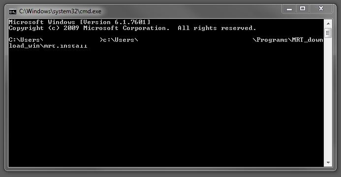
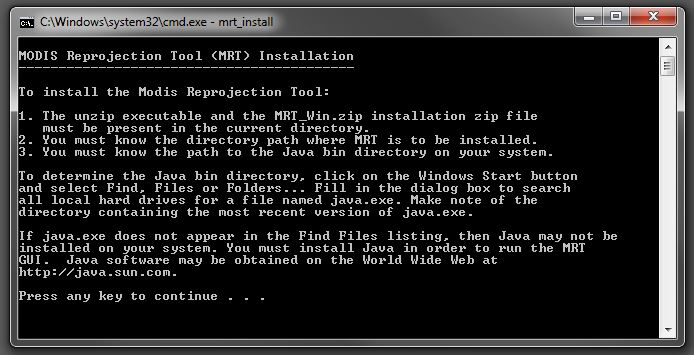
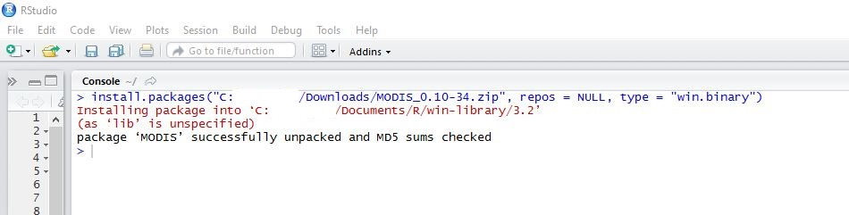
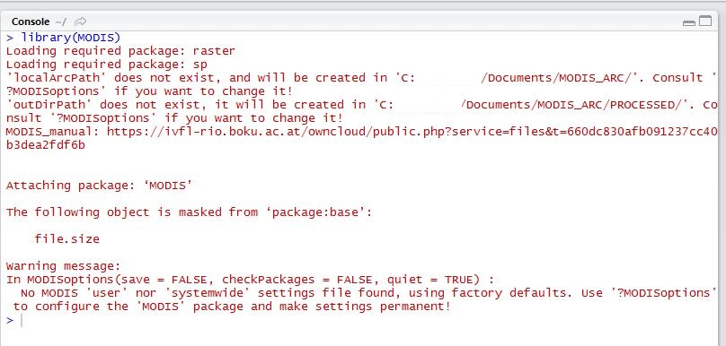
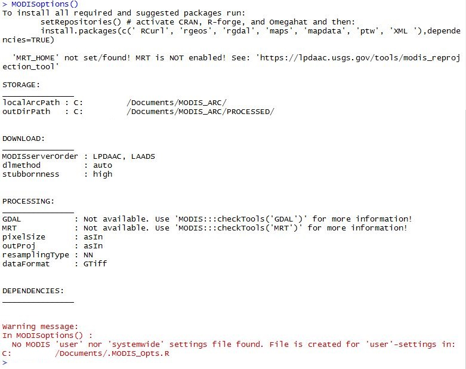
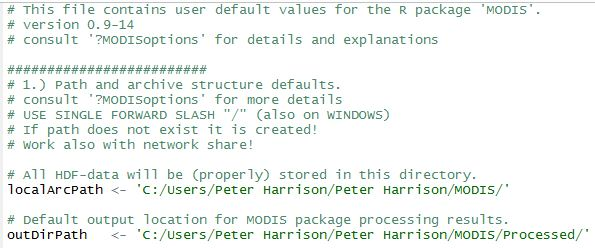
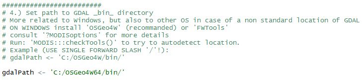

## 1. Introduction


  Globally, forests cover nearly one third of the world’s landmass and harbour over 80% of the world’s terrestrial biodiversity. Forests are not just important for biodiversity, but also provide important ecosystem functions such as carbon sequestration and hydrological services. These ecosystems, however, are under tremendous pressure from continued anthropogenic modifications of the environment. Since the year 2000, over 2.3 million square kilometres of native forests have been cleared (Hansen *et al* 2013), which has been estimated to have cost the global economy up to $20.2 trillion in lost revenue due to land use change (Costanza *et al* 2014). 


  Native vegetation may become increasingly fragmented through land-use changes, such as urbanisation and agriculture, resulting in a mosaic of remnant patches across the landscape. Habitat fragmentation can have a number of genetic implications on the remnant vegetation, including increased inbreeding due to altered pollinator patterns, and reduced effective population sizes (Ellstrand & Elam 1993; Broadhurst *et al*. 2015). This can result in reduced genetic quality of the seed and reduced seed availability, ultimately increasing the economic costs associated with seed collections and thus limiting the size and scope of ecological restoration projects (Broadhurst *et al*. 2008). However, the effects of habitat fragmentation may be species specific (Aguilar *et al*. 2006; Kramer *et al*. 2008), and fragmented remnants may still be a valuable source of seed (Ottewell *et al*. 2009).    


  To assist in the decision making process on whether to sample sites identified by `seedSource` or `seedSource_gui`, it is important to identify and flag whether a matched point is within a fragmented landscape. This vignette outlines the steps needed to create your own habitat fragmentation layer using the Moderate Resolution Imaging Spectroradiometer (MODIS; http://modis.gsfc.nasa.gov/about/) satellite data, which is now freely available at http://modis.gsfc.nasa.gov/data/dataprod/mod12.php. Briefly, the process is:
  
1. Install the required software (specific R packages, MODIS reprojection tool, and OSGeo4W)
2. Download, stitch together the mosaic of images, reclassify land cover classifications into broad groups, and convert raster to polygon shapefile (ESRI format)
3. Overlay the climatically similar points on the shapefile from Step 2 and identify points in potentially fragmented landscapes.

If you already have your own fragmentation layer, you can skip to the 'Example - Applying the fragmentation layer at Ross and Cressy, Tasmania, Australia' section below. Also, global level landscape classification layers can also be downloaded from http://worldgrids.org/doku.php?id=wiki:g12igb3 and http://worldgrids.org/doku.php?id=wiki:glcesa3. See http://worldgrids.org/doku.php?id=wiki:layers for a list of other potenitally useful environmental layers.


## 2. Downloading required programs


This section of the vignette is concerned with downloading and installing the required packages/programs to create a fragmentation layer. This section is a summary of the tutorial by Steven Mosher (https://stevemosher.wordpress.com/modis-tutorial/), and makes use of the following R packages: *MODIS* (Mattiuzzi *et al*. 2016), *MODISTools* (Tuck *et al*. 2014), *raster* (Hijmans 2015), *rasterVis* (Lamigueiro and Hijmans 2014), *maptools* (Bivand and Lewin-Koh 2015), and *sp* (Pebesma and Bivand 2005; Bivand *et al*. 2013).


There are two crucial programs that are required before you can download MODIS layers using R. The first is the MODIS Reprojection Tool (MRT) which is available from https://lpdaac.usgs.gov/tools/modis_reprojection_tool. You will need to create a user account, which is free and quick, before you can download this program. The installation steps are slightly confusing, but briefly you need to:


1. Download the program for your specific OS.
2. Unzip the software somewhere where you know the directory path.
3. Once the zip file is extracted, open the command prompt (on windows: start+R and type `cmd` in the search field, then click `OK`) and carefully type in the directory path to where MRT was extracted, along with `MRT_download_Win\mrt_install`. So you should have something along the lines of `C:\your\path>\MRT_download_Win\mrt_install`, see below. [See MRT user manual for installation instructions for other OS].





4. For the next steps need to specify the directory path were MRT it to be installed. You will also need to locate where the Java bin directory is. This is usually located in the `Programe Files` of the `C drive`. Otherwise, follow the instructions given by the installer to locate where the java.exe file is located. Once you know these directory paths, press any button on the keyboard and follow the prompts.





You should then end up with a folder in the same directory called `MRT41`, and within the `bin` folder in this direcotry should be the MRT program called `ModisTool.jar'. It is important to check you know where this file is as you will direct R to it in later steps.


The next stand-along program is `OSGeo4W` which is available at http://trac.osgeo.org/osgeo4w/. This is a binary distribution of a broad set of geoprocessing tools and contains over 150 programs (see http://trac.osgeo.org/osgeo4w/wiki/PackageListing) which are all relatively small and takes up approximately 1.51 Gb. But, within this bundle of programs are two powerful GIS applications (GRASS and QGIS) along with GDAL. Follow the 'Qucik Start for OSGeo4W Users' instructions. I recommend installing all packages at step 4. To determine whether your system is running 32-bit or 64-bit OS, right click on `Computer` from the start menu and click `Properties`, then see where it says 'System type: xx-bit Operating System'. 


The last thing to do is install the `MODIS` and `MODISTools` R packages (`sp` and `raster` would have been installed when `PUCA` was installed): 

* The `MODIS` tool is available at https://r-forge.r-project.org/R/?group_id=1252. For windows, you can either download the `.tar.gz` or `.zip` files as R will read both these. Then to install (in RStudio) either use the 'Packages' tab of the 'Files, Plots, Package, Help, View' panel. Or alternatively go to Tools > Install Packages... . Then select from the 'Install From' drop down menu the 'Package Archive File (.zip; tar.gz)' option. Click 'Browse' to direct to where `MODIS` was downloaded.

* 'MODISTools' can be installed following one of two ways:
    + Use the 'Packages' tab of the 'Files, Plots, Package, Help, View' pannel and change 'Install From' to 'Repository (CRAN, CRANextra)', then search for `MODISTools`;
    + Use the `reqLibs` function of the `PUCA` package:


```{r eval=FALSE, echo=TRUE}
?reqLibs

libs("MODISTools")
reqLibs(libs)
rm(libs)
```


Now that all programs and packages are downloaded and installed, we can now  configure `MODIS` by modifying the `.MODIS_Opts.t` file. First run the following code:


```{r, eval=FALSE, echo=TRUE}
library(MODIS)
MODISoptions()
```











The last message of the `MODISoption()` comand will direct you to a file where we need to edit the following:

1. Create a new folder where the MODIS layers are downloads and within that directory create another called `Processed'





2. Tell MODIS where to find GDAL





**IMPORTANT: do not change any other settings within this file unless you understand the changes! Additionally, do not move this .R file from its current location**


Once these changes are made and saved, run the following code to check `MODIS` is communicating with all the correct programs:


```{r eval=TRUE, echo=TRUE}
MODIS:::checkTools()
```


If there are any issues/errors during this setup, either consult Steven Mosher's blog (see above) or email me at P.A.Harrison@utas.edu.au.


## 3. Making the fragmentation layer


In this section I will breifly outline the processess to create a fragmentation layer. Firstly, lets load the required packages and create a data frame containing the coordinates of our revegetation site. The Land Classification layers we require to make the fragmentation layers are in the MODIS product 'MCD12Q1'. To find out what MODIS data is available and for which time periods, we use the `GetBands()` and `GetDates()` functions of the `MODISTools` package.


```{r eval=TRUE, echo=TRUE, message=FALSE}
## Load required libraries
##-------------------------

library(MODIS)
library(MODISTools)
library(rasterVis)
library(sp)
library(rgdal)
library(maptools)

# could also be loaded using
# libs('MODIS', 'MODISTools', 'rasterVis', 'mapdata', 'sp', 'rgdal', 'maptools')
# PUCA::reqLibs(libs)
# rm(libs)

```

```{r eval=TRUE, echo=TRUE}

## Set up revegetation site data frame
##-------------------------------------

# This example is for the Ross revegtation site

siteCoords <- data.frame(lat = -41.980778,
                         long = 147.457063)

## Find what data and for which time periods are available and store indatesForMODIS
##-----------------------------------------------------------------------------------

MODISTools::GetBands(Product = "MCD12Q1")
datesForMODIS <- MODISTools::GetDates(Product = "MCD12Q1", 
                                      Lat = siteCoords$lat, Long = siteCoords$lon)
datesForMODIS

```


The output of the call to `GetBands` shows there are 15 bands imbeded in the MCD12Q1 product. Here, the MODIS band we are interested in is the `Land_Cover_Type_1`, and the `GetDates` shows the most recent data for our site is from 2009 (i.e. 'A20090001').


To assist in downloading the required layers, I have written a simple wrapper function that calls the `runGdal` function of `MODIS`. The function first determines which tile to download  by overlaying and extracting out the tile coordinates (see `?modisGid`). Tile coordinates came from a KML file downloaded from http://spatial-analyst.net/wiki/index.php?title=Main_Page, which was converted to a `SpatialPolygonsDataFrame` using `rgdal::readOGR()`. The data for each unique tile coordinate is then downloaded. The resolution of the map is 0.005, which is approximately 500m. MODIS layers are resampled using the nearest-neighbour method. The function is below - copy this into the R console and hit Run to load it into the workspace.


```{r echo=TRUE, eval=TRUE}
#' Wrapper function to download MODIS data
#' 
#' @description A wrapper function to download MODIS data based on uniquely identified 
#' tile coordiantes.
#' 
#' @param modisGird A \code{SpatialPolygonsDataFrame} containing the MODIS tile coordinates
#' @param points A data set of coordinates with specific columns 'lat' and 'lon' which contain 
#' the latitude and longitude coordinates
#' @param date A time period to download MODIS data. See \code{?MODISTools::GetDates}
#' 
#' @return A data file of extension .hdf. This is usually downloaded into the specified file 
#' in \code{MODIS::MODISoptions()}.
#' 
#' @author P. A. Harrison
#' 
#' @references
#' \url{http://spatial-analyst.net/wiki/index.php?title=Main_Page}
#' 
getMODIS <- function(modisGrid, points, date){
  coordinates(points) <- ~lon+lat
  projection(points) <- modisGrid@proj4string
  
  tiles <- data.frame(over(x = points, y = modisGrid))
  
  func <- function(x) unlist(strsplit(as.character(unlist(strsplit(as.character(x), '>'))), '<'))[7]
  modisTiles <- do.call(rbind.data.frame, lapply(tiles$Description, FUN = func))
  colnames(modisTiles) <- "tile"
  
  ## get MODIS data
  for(x in unique(modisTiles$tile)){
    h = unlist(strsplit(as.character(unlist(strsplit(as.character(x), "h"))), "v"))[1]
    v = unlist(strsplit(as.character(unlist(strsplit(as.character(x), "h"))), "v"))[2]
    
    runGdal(product='MCD12Q1', tileH = h, tileV = v, #extent='australia', 
            begin = date, end = date, SDSstring='101', outProj = wgs84,
            pixelSize = 0.005)
  }
}
```


```{r echo=TRUE, eval=FALSE}
## Run the getMODIS function based on the unique tiles extracted for each distribution 
## point of Eucalyptus ovata in Tasmania, Australia (points = spDat).
##
## NB: For the data variable, I have removed the 'A' at the start of the dates (see
##     above output). This was achieved using strsplit. I have also extracted out the
##     most recent date, by only using the last date in the list.

getMODIS(modisGrid = modisGrid, points = spDat, 
         date = strsplit(datesForMODIS[length(datesForMODIS)], 'A')[[1]][2])

```


The data will then be downloaded from the MODIS data repository, reprojected and resampled using MRT and GDAL, then placed in the 'Processed' folder specified during the `MODIS` setup. All processed MODIS layers are written as GeoTiffs (.tif) which can then be read back into R using the `raster` package.[Note: `raster` does not recognise the raw MODIS format (.hdf)].


```{r echo=TRUE, eval=FALSE}
## Example on how to read the MODIS layers back into R.

LC_1 <- raster("~\\MODIS\\Processed\\
               MCD12Q1.051_20160209193740\\MCD12Q1.A2009001.Land_Cover_Type_1.tif")
```


For example purposes, the MODIS data for Tasmainia is available using `data("LC_tas")`. This was created based on two MODIS tiles. Each tile was reclassified into a broad-scale vegetation clasification scheme, and then merged using `raster::mosaic`. The following code was used to create this raster.


```{r echo=TRUE, eval=FALSE}

## Reclassify the each raster by collapsing the University of Maryland scheme into
## seven categories:
##
## class 1 - water
## class 2 - forest
## class 3 - shrublands
## class 4 - savannas
## class 5 - grasslands
## class 6 - croplands
## class 7 - built-up/barren

LC_1a <- cut(LC_1, c(-1,0,5,7,9,10,12,16))
LC_2a <- cut(LC_2, c(-1,0,5,7,9,10,12,16))

## define the raster as categorical

LC_1a <- ratify(LC_1a)
LC_2a <- ratify(LC_2a)

## add a Raster Attribute Table (RAT)

RAT <- levels(LC_1a)[[1]]
RAT$classes <- c("Water","Forest","Shrublands","Savanna","Grasslands","Croplands",
                 "Built-up/Barren")
levels(LC_1a) <- RAT
levels(LC_2a) <- RAT

## Clip the land cover rasters to the Tasmanian shapefile and join them together 
## using mosaic

LC_1a <- crop(LC_1a, tasshp)
LC_2a <- crop(LC_2a, tasshp)

LC_tas <- mosaic(LC_1a, LC_2a, fun = mean)
levels(LC_tas) <- RAT
```

```{r echo=TRUE, eval=TRUE, fig.width=6, fig.height=6, message=FALSE}
## Load the mosaic land cover for Tasmania
## data("LC_tas") is only ran here to load the data sete and does not need to be
## ran after running the above code.
library(PUCA)
data("LC_tas", package = 'PUCA')

cols <- c("red2","gold","forestgreen","chartreuse2","darkolivegreen3","yellow3","blue")
rasterVis::levelplot(x = LC_tas, col.regions = cols, names.attr = c("2009"))
```


The last step is to remove the unwanted categories (i.e. water, forest, shrublands, savannas, grasslands) to create a fragmentation layer based on anthropogenic disturbances (i.e. croplands and built-up/barren classifications). This is achieved using the following code. The below code also converts the `raster` object into a `SpatialPolygonsDataFrame` object. To export the `SpatialPolygonsDataFrame` as a shapefile that can be read into GIS, see `?rgdal::writeORG` or `?maptools::writeSpatialShape`. I provide below an example to create an ESRI shapefile.


```{r, echo=TRUE, eval=TRUE}
## Drop unwanted levels

fragLayer <- raster::calc(LC_tas, fun = function(x) {ifelse(x < 6, NA, 1)})

## Convert to polygon

fragLayer <- raster::rasterToPolygons(fragLayer)

## Write SpatialPolygonsDataFrame as ESRI shapefile
## First step is to create a new directory in your working directory (see getwd() 
## for your working directory). Then write the files into this directory.
## Note: all files in the output directory are need when reading the shapefile.

#dir.create("fragShapefile")
#rgdal::writeOGR(obj = fragLayer, dsn = "fragShapefile", layer = "fragLayer", 
#                driver = "ESRI Shapefile")
#maptools::writeSpatialShape(x = fragLayer, fn = "fragShapefile")
```


## 4. Example - Applying the fragmentation layer at Ross and Cressy, Tasmania, Australia


Now we have created a fragmentation layer (i.e. `fragLayer`), we can identify potential seed sources (from the output of the `seedSource` or `seedSource_GUI`) that occur in fragmented landscapes. The output for the Ross and Cressy sites are available by calling `data('rossCollect', package = 'PUCA')` and `data('rossCollect', package = 'PUCA')`. This data was generated by Harrison *et al*. (in press), and we make this data available for demonstration purposes. These data sets only contain those distribution records that were most climatically similar to the Ross and Cressy sites across four time slices (contemporary, 2020s, 2050s and 2080s), and further information about these data sets can be obtained using `?PUCA::rossCollect` or `?PUCA::cressyCollect`.

To assist in identifying which seed sources occur in fragmented landscapes, I have written a short function which is below. This function has three input variables: 

1. `data` which contains a list of the compiled output from `seedSource` or `seedSource_GUI`
2. `fragSHP` which contains a the fragmentation layer we just created (or your own fragmentation layers)
3. `utm` which is a logical indicator of whether the fragmentation shapefile is projected using UTM or latlon decimal degrees. Setting this to `FALSE` uses latlon decimal degrees.

This function, when ran, will print the results to the console and return an object of class `list` that is the same length as the data object with the addition of a new column variable called 'frag' which contains a binary output of success, where 1 = fragmented and 0 = not fragmented. The printed results will have three columns: `id` which is the unique identified, `in_frag` is the number of points identified as occuring in fragmented landscapes, and `pc_frag` which is the pre cent of total points identified as occuring in fragmented landscapes. Note, if you get an <NA> in any of the rows, it means no data was found for that specific time slice.

(At the time of writing this vignette, this function will ony accept a data object of class `list`. At a later stage this limitation will be removed - or anyone comfortable with R can modify this to suit their needs. Also it assumes, if using `utm = TRUE`, that the shapefile is in UTM coordinates and the output from `seedSource` or `seedSource_GUI` is in the following order: cloumn 1 contains the identifier, column 2 the longitudinal coordinates, and column 3 the latitude coordinates.) 


```{r echo=TRUE, eval=TRUE}
#' Helper function to identify fragmented points
#' 
#' @description A helper function to identify which points from the output of \code{seedSource} or 
#' \code{seedSource_GUI} that occur in fragmented landscapes. 
#' 
#' @param data A list of the compiled output from `seedSource` or `seedSource_GUI`
#' @param fragSHP A fragmentation layer, generally of class \code{SpatialPolygonsDataFrame}
#' @param utm a logical indicator of whether the fragmentation shapefile is projected using UTM or latlon 
#' decimal degrees. Setting this to `FALSE` uses latlon decimal degrees.
#' 
#' @return A list of \code{length(data)} with an additional new column variable called 'frag' which 
#' contains a binary output of success, where 1 = fragmented and 0 = not fragmented
#' 
#' @author P. A. Harrison
#' 

isFragmented <- function(data, fragSHP, utm = FALSE){
  if(!inherits(data, "list")){stop("Sorry, only lists are currently accepted for 'data'.")}
  mat <- matrix(nrow = length(data), ncol = 3)
  newList <- list()
  for(i in 1:length(data)){
    cat(paste(i, "...", sep = ""))
    tmp <- data[[i]]
    name <- as.character(tmp[1,1])
    if(nrow(tmp) < 1){mat[i, 1] <- name; mat[i, 2] <- NA; mat[i, 3] <- NA} else{
      if(utm){tmp <- dd2utm(id = 1, long = 2, lat = 3, data = tmp)
              sp::coordinates(tmp) <- ~east+north} else{
                sp::coordinates(tmp) <- ~Longitude+Latitude}
      raster::projection(tmp) <- fragSHP@proj4string@projargs
      ov <- sp::over(x = tmp, y = fragSHP, fn = NULL)[1]
      ov <- data.frame(ifelse(is.na(ov), 0, 1))
      colnames(ov)<-"frag"
      mat[i, 1] <- name
      mat[i, 2] <- length(ov[which(ov$frag == 1), ])
      mat[i, 3] <- round(length(ov[which(ov$frag == 1), ]) / nrow(data[[i]]) * 100, 0)
      newList[[name]] <- data.frame(data[[i]], ov)
      }
    }
  colnames(mat) <- c("id", "in_frag", "pc_frag")
  cat("DONE!\n\n")
  print(as.data.frame(mat))
  invisible(newList)
}
```


As before, copy the above code into the console and hit Run to load the function into the workspace. Once this is done we can run the `isFragmented` function as below. While the code is running, it will print to the console which data set it is on, for example 1..2..3.. means the code has processed through the first three data sets contained in the `list` and is now processing data set 4.


```{r echo=TRUE, eval=TRUE}
rossCollect2 <- isFragmented(data = rossCollect, fragSHP = fragLayer, utm = FALSE)

cressyCollect2 <- isFragmented(data = cressyCollect, fragSHP = fragLayer, utm = FALSE)

```


As the output shows, at least 15% of records matched to the contemporary time slice occur in fragmented landscapes (ie *Euclayptus amygdalina* at Ross). This increases to nealy 90% of records matched to the 2050s time slice (ie *Euclayptus ovata* at Cressy)  These results differ slightly to those presented by Harrison *et al*. (in press) because of the slight difference between the fragmentation layer that was created in this vignette and the fragmentation shapefile that was used by Harrison *et al*. (in press). Thus, these results (both presented here and in Harrison *et al*. (in press)) should be used in combination with other information, such as outcrossing rates  for the target species (or from similar species), during the decission making processes to guide the collection of seed for ecological restoration. 


## 5. References


Aguilar, R., Ashworth, L., *et al*. (2006) Plant reproductive susceptibility to habitat fragmentation: review and synthesis through a meta-analysis. Ecology Letters, 9, 968-980.

Bivand R and Lewin-Koh N (2015). maptools: Tools for Reading and Handling Spatial Objects. R package version 0.8-37.https://CRAN.R-project.org/package=maptools
  
Bivand R.S., Pebesma E., Gomez-Rubio V. (2013) Applied spatial data analysis with R. Second edition. Springer, NY. http://www.asdar-book.org/

Broadhurst, L., Driver, M., *et al*. (2015) Seeding the future - the issues of supply and demand in restoration in Australia. Ecological Management & Restoration, 16, 29-32.

Broadhurst, L.M., Lowe, A., *et al*. (2008) Seed supply for broadscale restoration: maximizing evolutionary potential. Evolutionary Applications, 1, 587-597.

Costanza R, de Groot R, *et al.* (2014) Changes in the global value of ecosystem services. Global Environmental Change-Human and Policy Dimensions 26, 152-158.

Ellstrand, N.C. & Elam, D.R. (1993) Population genetic consequences of small population size: implications for plant conservation. Annual Review of Ecology and Systematics, 24, 217-242.

Hansen MC, Potapov PV, *et al*. (2013) High-Resolution Global Maps of 21st-Century Forest Cover Change. Science 342(6160), 850-853.

PA Harrison, RE Vaillancourt, RMB Harris, BM Potts (in press) Predicting seed sources for future climates. Journal of Applied Ecology.

Hijmans RJ (2015). raster: Geographic Data Analysis and Modeling. R package version 2.5-2. https://CRAN.R-project.org/package=raster.

Kramer, A.T., Ison, J.L., *et al*. (2008) The paradox of forest fragmentation genetics. Conservation Biology, 22, 878-885.

Lamigueiro OP and Hijmans R (2014), rasterVis. R package version 0.31. doi:10.5281/zenodo.12394

Ottewell, K.M., Donnellan, S.C., *et al*. (2009) Predicting reproductive success of insect- versus bird-pollinated scattered trees in agricultural landscapes. Biological Conservation, 142, 888-898.

Pebesma, E.J., Bivand R.S. (2005) Classes and methods for spatial data in R. R News 5 (2), http://cran.r-project.org/doc/Rnews/
  
Tuck SL, Phillips HRP, *et al*. (2014) MODISTools - downloading and processing MODIS remotely sensed data in R. Ecology and Evolution 4(24), 4658-4668.


